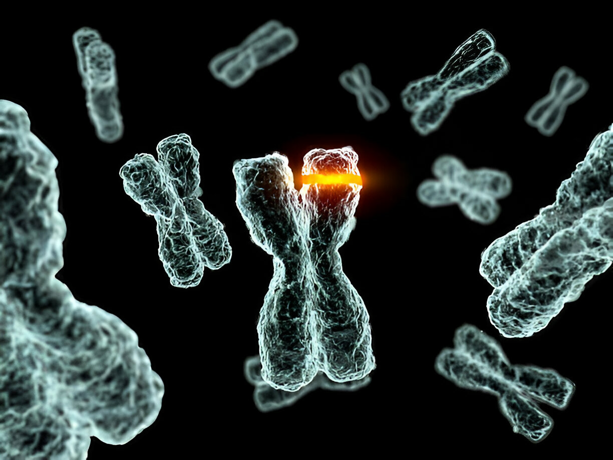

# ⚗️ DNA to RNA to Protein Converter

Welcome to the **Central Dogma of Molecular Biology** webpage! 🧬 

Ever wondered how DNA is transformed into RNA and then into proteins? You're in the right place! This repository hosts an interactive tool that allows you to explore this fascinating process without getting lost in the details.

## 🚀 Overview

This webpage serves as an interactive tool to demonstrate the fundamental principles of genetic expression. From inputting your DNA sequence to witnessing its conversion into RNA and then into protein, delve into the molecular world with us. This project is ideal for students, educators, and anyone intrigued by the realms of molecular biology and genetics.

## ✨ Features

- **🌟 Simplicity**: No need for a genetics degree to explore the beauty of this fundamental biological process.
- **✨ Interactivity**: Experience the wonders of molecular biology with our user-friendly interface.
- **🔄 Reset Option**: Start fresh anytime with the 'CLEAR' button.

## 🧬 How to Use

1. **Input DNA Sequence**: Enter your DNA sequence in the designated field and get ready to witness the magic of molecular transformation.
2. **Convert**: Hit the CONVERT button to initiate the conversion process, where your DNA sequence will be transcribed into RNA and translated into its corresponding protein sequence.
3. **Clear**: Want a fresh start? Simply hit CLEAR to wipe the fields clean and begin anew.

## 🌟 Visualize the Process

Immerse yourself in the explanatory video provided, guiding you through the intricacies of DNA transcription and translation.

## 💻 Technologies Used

- **HTML & CSS**: Providing the structure and style to the webpage for an engaging user experience.
- **JavaScript**: Powering the dynamic functionality behind DNA sequence conversion.
- **Video Element**: Enhancing understanding through visual aid.

## 🙏 Acknowledgements

- **Background Image**: Captivating visual representation provided by the mesmerizing image of chromosomes.
- **Codon to Amino Acid Mapping**: Gratitude to the comprehensive mapping facilitating the translation of RNA into proteins.

---

*Note: This tool is for educational purposes only and should not be used for diagnostic or clinical applications.*

---

Explore the magic of the molecular world and decode the language of life with us! 🌟🧬

